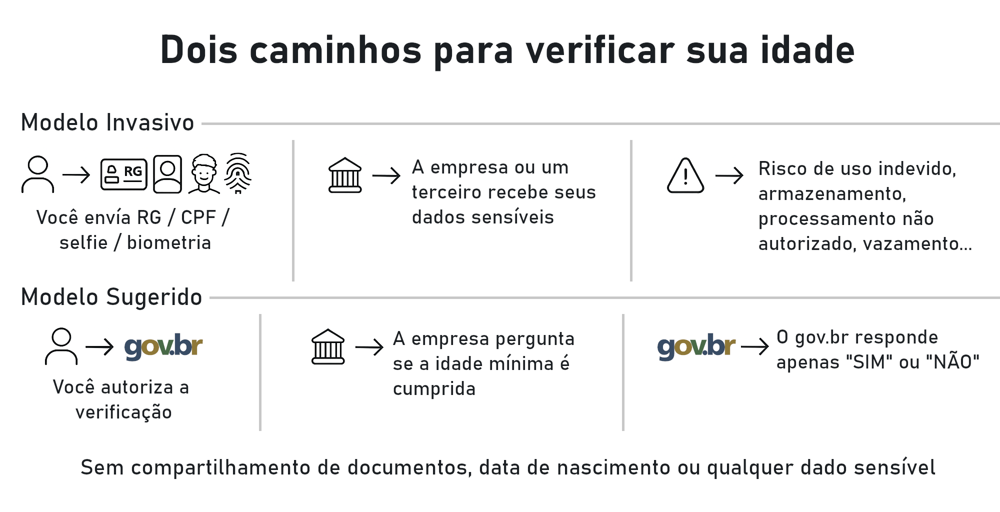

# Entenda a ideia

> **Aviso importante**  
> Este documento é **independente** e **não é oficial**.  
> Ele existe para explicar melhor uma ideia legislativa publicada no portal e-Cidadania.  
> O conteúdo abaixo **não faz parte do processo legislativo**, **não representa o governo** e **não define** o que um eventual projeto de lei poderá dizer no futuro.  
> O que está sob nosso controle é apenas o texto oficial publicado na ideia legislativa.

---

## Navegação rápida

- [O que é este texto](#o-que-é-este-texto)
- [O que é uma ideia legislativa](#o-que-é-uma-ideia-legislativa)
- [Resumo da ideia](#resumo-da-ideia)
- [Por que essa discussão existe](#por-que-essa-discussão-existe)
- [Por que isso importa para você](#por-que-isso-importa-para-você)
- [Fato e visão: o que está na ideia e o que é apenas uma possibilidade](#fato-e-visão-o-que-está-na-ideia-e-o-que-é-apenas-uma-possibilidade)
- [Perguntas frequentes](#perguntas-frequentes)
- [Críticas comuns](#críticas-comuns)
- [Quem pode resistir a isso](#quem-pode-resistir-a-isso)
- [Como você pode ajudar](#como-você-pode-ajudar)

---

## O que é este texto

Este material foi feito para quem quer entender melhor uma ideia legislativa sobre **verificação de idade com mais privacidade**.

Aqui você encontra:

- um resumo simples da ideia;
- o contexto do tema;
- explicações técnicas em linguagem comum;
- dúvidas frequentes;
- críticas previsíveis;
- e uma visão de como algo assim **poderia** funcionar.

Você **não precisa ler tudo**. Cada bloco foi pensado para funcionar sozinho.

---

## O que é uma ideia legislativa

No portal e-Cidadania, qualquer cidadão pode propor uma ideia para criação ou mudança de lei.

Se a ideia atingir **20 mil apoios dentro do prazo**, ela vira uma **Sugestão Legislativa** e segue para análise no Senado. Se for acolhida pela comissão responsável, ela pode ser transformada em proposição legislativa.

Isso significa duas coisas importantes:

1. **Apoiar uma ideia não cria uma lei automaticamente.**
2. **Mesmo que a ideia avance, o texto final de um eventual projeto não fica nas mãos do autor da ideia.**

[Apoie a ideia legislativa no e‑Cidadania](https://www12.senado.leg.br/ecidadania/visualizacaoideia?id=217432)
**Prazo para apoiar:** 07/08/2026

---

## Resumo da ideia

A ideia é simples:

Se uma empresa precisar verificar sua idade, ela deve ser obrigada a oferecer, no mínimo, uma opção oficial via gov.br.

Nessa opção, a empresa **não receberia seus documentos, sua biometria nem sua data de nascimento**.  
Ela receberia apenas a confirmação do que precisa saber para aquele caso: por exemplo, se você está ou não acima da idade exigida.

*Comparação simplificada entre um modelo invasivo de verificação e um modelo com menor compartilhamento de dados.*

A lógica é direta: se o Estado já possui os dados necessários para essa checagem, a verificação pode ser feita com **menos compartilhamento**, **menos exposição** e **menos risco** para o cidadão.

---

## Por que essa discussão existe

A verificação de idade no ambiente digital deixou de ser uma hipótese distante. Esse debate já está acontecendo de forma concreta.

O problema aqui não é a existência da verificação de idade em si.

O problema é **como isso será feito**.

Se o modelo adotado exigir envio de documento, selfie, biometria ou outras informações sensíveis para várias empresas privadas, o cidadão passa a espalhar dados delicados por muitos lugares ao mesmo tempo.

E isso importa porque, em privacidade, a pergunta não é só **“quem já tem meus dados?”**.  
A pergunta também é: **“quem mais vai passar a ter?”**

---

## Por que isso importa para você

Talvez hoje você pense que isso só vale para plataformas “dos outros” ou para pessoas “em outra situação”.

Mas imagine um cenário simples:

Você abre uma rede social, um app, um site ou um serviço qualquer.  
A plataforma decide que precisa confirmar sua idade.  
E então ela pede sua selfie.  
Ou seu documento.  
Ou os dois.

Nesse momento, o problema deixa de ser abstrato.

Você não está mais discutindo “regulação digital”.  
Você está decidindo se vai ou não entregar seu rosto, seu documento ou sua biometria para mais uma empresa.

E aqui está o ponto mais importante:

- senha você troca;
- cartão você bloqueia;
- documento e biometria não funcionam do mesmo jeito.

Por isso essa discussão não é só sobre tecnologia.  
Ela é sobre **quanto do seu corpo, da sua identidade e da sua vida digital você vai ser obrigado a distribuir por aí para provar algo simples**.

O centro desta ideia é justamente esse:  
se existe uma forma de verificar idade com **menos exposição**, por que normalizar a mais invasiva?

---

## Fato e visão: o que está na ideia e o que é apenas uma possibilidade

### O que é fato

> **Fato:** o que vale oficialmente é apenas o texto publicado na ideia legislativa no e-Cidadania.

A parte oficial da ideia é esta, em termos simples:

- empresas que precisarem verificar idade devem oferecer uma alternativa oficial via gov.br;
- essa alternativa deve buscar o menor compartilhamento de dados possível;
- a empresa não deveria receber seus documentos, sua biometria ou sua data de nascimento para essa checagem;
- para menores de idade, deve existir um fluxo próprio com participação do responsável legal.

Esse é o núcleo da ideia.

### O que é visão do autor

> **Visão do autor:** tudo abaixo é apenas uma forma possível de imaginar a implementação.  
> Não é texto oficial da ideia legislativa.  
> Não faz parte do processo do Senado.  
> E não significa que algo assim seria adotado, se a ideia avançar.

Uma implementação ideal, na visão do autor, poderia seguir uma lógica como esta:

- a plataforma pergunta apenas o que precisa saber para aquele caso;
- o serviço responde apenas “sim” ou “não” sobre a faixa etária necessária;
- a empresa não recebe documento, data de nascimento, CPF ou biometria;
- o governo não precisa saber em qual serviço a verificação foi usada;
- o usuário poderia consultar um registro mínimo, como data e hora das verificações;
- para menores, deveria existir um fluxo próprio, simples e seguro, com consentimento do responsável legal.

Mais uma vez: isso é **visão**, não promessa.  
Serve para facilitar o entendimento da ideia, não para definir o que aconteceria no mundo real.

---

## Perguntas frequentes

### Isso quer dizer que o gov.br passaria a controlar o que eu acesso?

Não é essa a lógica da ideia.

A proposta não parte do princípio de vigilância sobre o que você faz online.  
O objetivo é apenas criar uma forma de confirmar idade com menos compartilhamento de dados do que modelos baseados em envio de documento, selfie ou biometria para empresas privadas.

---

### Isso seria a única forma de verificação?

Não necessariamente.

A ideia central é que essa opção **precise existir**.  
O foco é garantir uma alternativa mais segura e menos intrusiva para o cidadão.

---

### A empresa receberia meus dados?

Na lógica defendida aqui, não.

Ela receberia apenas a confirmação do requisito etário necessário para aquele caso.

A diferença é justamente essa:  
**verificar idade** não precisa significar **coletar seus documentos**.

---

### O governo saberia onde eu usei essa verificação?

Na visão defendida aqui, não deveria saber.

Essa separação é importante porque a proposta tenta evitar dois excessos ao mesmo tempo:

- excesso de coleta por empresas;
- excesso de rastreamento por parte do Estado.

---

### E os menores de idade?

Esse é um dos pontos mais importantes do debate.

A ideia não deveria ignorar esse problema.  
Ao contrário: para menores, a solução precisaria de um fluxo próprio, com consentimento do responsável legal e desenho específico.

O objetivo não é excluir crianças e adolescentes.  
O objetivo é evitar que a resposta ao problema seja simplesmente espalhar ainda mais dados sensíveis.

---

### E se alguém usar a conta de outra pessoa?

Esse risco existe em praticamente qualquer modelo remoto de verificação.
Esse risco já existe hoje em diversos serviços digitais, contas emprestadas, documentos de terceiros, etc.

Nenhum sistema digital resolve fraude de forma perfeita sem ficar invasivo demais.

A discussão correta não é “como zerar todo risco”.  
A discussão correta é: **qual modelo reduz dano sem exigir exposição excessiva do cidadão?**

---

## Críticas comuns

### “Isso não vai funcionar”

Talvez não funcione exatamente do jeito imaginado aqui.

Mas a questão principal é outra:  
esse debate já está acontecendo, e algum padrão será adotado.

Se a sociedade não disputar esse padrão, ele pode acabar sendo definido de um jeito pior para o cidadão.

---

### “É mais simples pedir documento”

Pode parecer simples no fluxo.  
Mas simplicidade para a plataforma não é a mesma coisa que segurança para a pessoa.

Pedir documento, selfie ou biometria pode ser prático para quem coleta.  
Isso não significa que seja o melhor modelo para quem entrega.

---

### “Quem não deve não teme”

Privacidade não é esconder erro.  
Privacidade é limitar exposição desnecessária.

A pergunta não é se alguém está fazendo algo errado.  
A pergunta é se a pessoa precisa mesmo entregar mais dados do que o necessário para provar algo simples.

---

### “Sempre vai dar para burlar”

Fraude existe em qualquer sistema.

Isso não é motivo para aceitar automaticamente o modelo mais invasivo.  
A resposta a esse tipo de risco precisa ser proporcional.

---

## Quem pode resistir a essa ideia

Acredito que existirá resistência de algumas partes a uma ideia desse tipo.
Alguns por motivações coerentes e/ou técnicas.
Mas também vejo outros riscos.

Este bloco não é uma acusação contra pessoas ou empresas específicas.
Apenas uma leitura sóbria do tema.

Uma proposta como essa pode enfrentar resistência de quem:

- prefira soluções próprias e fechadas;
- tenha interesse econômico em modelos privados de verificação;
- veja a coleta de mais dados como algo normal ou conveniente;
- trate privacidade como detalhe secundário;
- considere mais simples empurrar o custo e o risco para o cidadão.

Vale dizer com clareza:  
quando um novo padrão é discutido, nem todo mundo ganha com um modelo que reduz coleta de dados.

Por isso, deixar esses interesses visíveis desde o começo também ajuda a qualificar o debate.

---

## Como você pode ajudar

Se essa ideia fizer sentido para você, existe um ponto simples:

**ela não anda sozinha.**

Para avançar, uma ideia legislativa precisa reunir **20 mil apoios dentro do prazo**.

Isso é muita gente.  
Não acontece por acaso.  
E não acontece só porque a ideia “é boa”.

Se você acha que isso merece ser debatido, ajudar significa:

- apoiar a ideia;
- compartilhar o link;
- explicar o tema para outras pessoas;
- conversar com amigos, familiares e colegas;
- trazer mais gente para perto da discussão.

A verdade é simples:  
sem esforço coletivo, uma ideia assim pode morrer antes mesmo de começar a ser discutida de verdade.

**Link da ideia legislativa:**  
👉 https://www12.senado.leg.br/ecidadania/visualizacaoideia?id=217432
**Prazo final:** 07/08/2026

---

## Transparência final

Este documento não é uma promessa de resultado.

Ele não promete que a ideia será aprovada.  
Não promete que o Senado concordará com ela.  
Não promete que um eventual projeto manterá a mesma lógica.  
E não promete que qualquer implementação futura seguirá a visão descrita aqui.

O que este site pretende fazer é algo mais simples e mais honesto:

- explicar melhor a ideia;
- reduzir dúvidas;
- tornar a discussão mais clara;
- e mostrar por que esse tema pode afetar diretamente a vida de qualquer pessoa.
